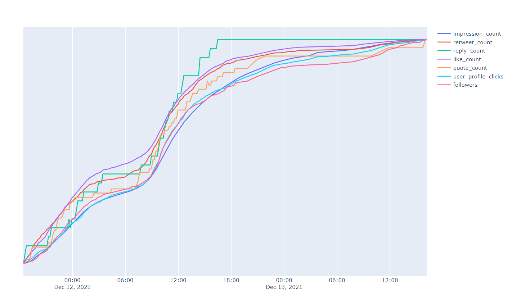

# Tweetmetric

Tweetmetric allows you to track various metrics on your most recent tweets, such as impressions, retweets and clicks on your profile.



The code is in Python, and the frontend uses Dash (a Plotly web interface). Tweetmetric uses Redis as a fast database.

## Docker images

You'll find ready to use images on docker hub:

* [tweetmetric-fetch-loop](https://hub.docker.com/repository/docker/comworkio/tweetmetric-fetch-loop)
* [tweetmetric-viz-server](https://hub.docker.com/repository/docker/comworkio/tweetmetric-viz-server)

Docker images are built and updated from a [mirror repo](https://gitlab.comwork.io/oss/Tweetmetric).

## Demo

You can access a [demo here](https://mathis.h25.io:8050) based on @MathisHammel's tweets.

## Connect to Twitter

Tweetmetric uses private metrics that can only be accessed by the Tweet's owner. You need to provide your API keys to the program so it can work.
- Request a Twitter API key on [The Twitter developer portal](https://developer.twitter.com/en/docs/twitter-api/getting-started/getting-access-to-the-twitter-api). This only takes a couple minutes, you need to have a verified phone number on your account.
- Generate a user token for the app you just created on [the developer dashboard](https://developer.twitter.com/en/portal/dashboard)

## Getting started

### Standalone setup

- Store the Twitter secrets in their corresponding environment variables (variable names are in the `src/api_secrets.py` file)
- Run `cd src; ./launch.sh`

### Using Docker

Install `docker` and `docker-compose`.

If you're on windows or mac, you can use [Docker Desktop](https://www.docker.com/products/docker-desktop) and use `docker-compose` instead of `docker compose`.


```shell
$ cp .env.dist .env
# replace all the variables in the .env file
$ docker-compose up -d
```

Store your Twitter secrets in their corresponding strings inside a `.env` file (you can create it from the [`.env.dist`](./.env.dist) example)

Note: you can pick only the [docker-compose file](./docker-compose.yml) and create your `.env` file without having to clone this git repository.

## Contributions

If you have to add a python dependency in order to patch or add some features, please update [requirements.txt](./src/requirements.txt) accordingly.

If you need to rebuild the images because you made some changes:

```shell
$ docker-compose up -d --build
```
