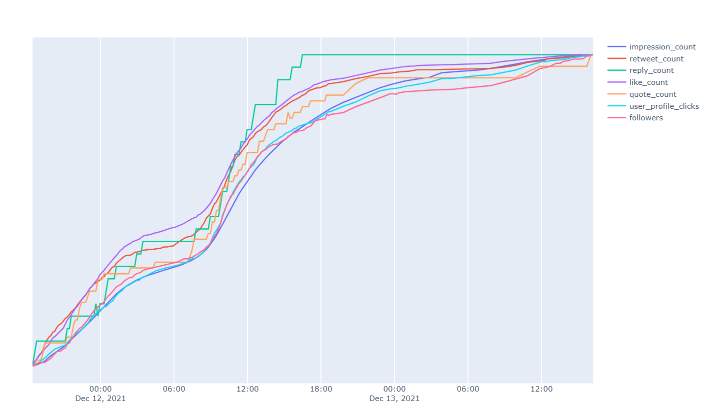

# Tweetmetric

Tweetmetric allows you to track various metrics on your most recent tweets, such as impressions, retweets and clicks on your profile.



The code is in Python, and the frontend uses Dash (a Plotly web interface). Tweetmetric uses Redis  as a fast database

## Install and run

### Installation

Run the following commands to install the project and start Redis:

```bash
pip install redis dash pandas tweepy pytz
sudo apt install redis
redis-server
```

If you want the database to be persistent after reboots, enable Redis AOF by adding `appendonly yes` to your Redis configuration file (usually in /etc/redis/redis.conf)

### Getting Twitter tokens

Tweetmetric uses private metrics that can only be accessed by the Tweet's owner. You need to provide your API keys to the program so it can work.
- Request a Twitter API key on [The Twitter developer portal](https://developer.twitter.com/en/docs/twitter-api/getting-started/getting-access-to-the-twitter-api). This only takes a couple minutes, you need to have a verified phone number on your account.
- Generate a user token for the app you just created on [the developer dashboard](https://developer.twitter.com/en/portal/dashboard)
- You should now have 5 secrets provided by Twitter. Store them in their corresponding strings inside api_secrets.py

### Start

Your environment should be ready now. To run the server in background :

`./launch.sh` 

This command displays server logs, but exiting with Ctrl-C will not kill the server.